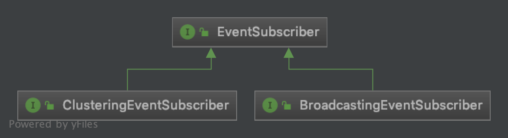

# 基于mq实现的领域事件

## 1. 阿里云RocketMQ

1.1 文档 
阿里云消息队列RocketMQ文档   
https://help.aliyun.com/product/29530.html?spm=a2c4g.11186623.6.540.4bcc3415sKRLsR

1.2 集群消费和广播消费  
https://help.aliyun.com/document_detail/43163.html?spm=a2c4g.11186623.6.560.b8223622HOn9bp

集群消费模式下，每一条消息都只会被分发到一台机器上处理。  
如果需要被集群下的每一台机器都处理，请使用广播模式。

## 2. MQ配置

```yaml
aliyun:
  mq:
    accessKey: xxxxx
    accessSecretKey: xxxx
    nameServer: http://xxxxxx.aliyuncs.com:80
    main:
      topic: tyx-test-master

      # 集群消息发布和订阅者id(集群订阅模式): 每个服务都应定义不同的groupId
      groupId: GID-tyx-dev1-tmcservices-1

      # 广播消息订阅者id: 每个服务都应定义不同的broadcastingGroupId, 必须与集群模式的订阅者id不同, 如果不需要可以不配置
      broadcastingGroupId: GID-tyx-dev1-tmcservices-2

      # domainEvent对应的tag前缀: 用来在不同环境共用topic, 每套环境中的各个服务需要定义相同的eventTagPrefix
      eventTagPrefix: dev1-
```

## 3. 事件相关概念

消息发布和订阅，都基于阿里云提供的RocketMQ的SDK实现，在RocketMQ基础上进一步封装，抽象出事件相关的概念。

RocketMQ SDK(基于TCP协议):
```gradle
compile('com.aliyun.openservices:ons-client:1.8.7.1.Final')
```
RocketMQ：
  - Topic: 消息主题，一级消息类型，通过Topic对消息进行分类
  - Tag: 消息标签，二级消息类型，用来进一步区分某个Topic下的消息分类
  - Group: 一类Producer或Consumer，这类Producer或Consumer通常生产或消费同一类消息，且消息发布或订阅的逻辑一致。 
  - Message Id: 消息的全局唯一标识，由消息队列RocketMQ版系统自动生成，唯一标识某条消息
  - Message Key: 消息的业务标识，由消息生产者（Producer）设置，唯一标识某个业务逻辑
  - Message Body: 消息体, 类型为byte[]

事件类型（EventType):   
  - 用来区分不同的事件，事件类型不允许重复，事件类型和mq底层的Tag相对应（tag = eventTagPrefix + eventType）

事件（DomainEvent）：
  - 用来表示事件相关的数据
  - 所有具体的领域事件参数都必须继承自DomainEvent抽象基类
  - 底层将DomainEvent序列化为json格式，作为RocketMQ的Message Body进行传输
  - 事件命名一般以动词过去式命名，比如当预算单位删除以后，引发BudgetUnitDeletedEvent
  - java代码如下：

```java
/**
 * 事件参数的抽象基类, 包含事件相关的数据
 */
@Getter
@Setter
public abstract class DomainEvent {

  /**
   * 事件的唯一标识，业务相关的标识，相当于阿里云RocketMQ的Message Key
   */
  private String key;

  /**
   * 事件类型，和mq中的tag保持一致(tag可能包含前缀，但eventType字段并不包含前缀)
   */
  private String eventType;

  /**
   * 事件发布时间(北京时间，格式为yyyy-MM-dd HH:mm:ss.SSS)
   */
  private String publishTime;

  /**
   * 事件发布者(对应于mq中发送者的groupId)
   */
  private String publisher;
  
  // other info
  // ...
}
```
事件发布：
 - 指调用底层阿里云SDK, 将事件相关的数据发送到mq队列中。

事件订阅：
 - 指订阅客户端监听相关的mq消息通知，当有消息通知到达时，进行相应的逻辑处理。
 
## 3. 发布事件

发布事件的实现代码：

```java
@Service
@AllArgsConstructor
public class EventPublisher {
  
  private MqProducer mqProducer;
  
  /**
   * 发布领域事件
   */
  public void publish(DomainEvent event) {
    // 检查事件参数的有效性
    assertEventValid(event);

    // 填充事件的发送信息
    event.setPublisher(mqConfig.getGroupId());
    event.setPublishTime(nowOfBeijing());

    //发送事件到消息队列
    String tag = getTag(event);
    String body = JsonUtils.toJson(event);
    mqProducer.sendToQueue(tag, event.getKey(), body);

    log.debug("publish event successful, tag: {}, body: {}", tag, body);
  }
}
```

## 4. 订阅事件

事件订阅相关的接口：



- EventSubscriber: 所有事件订阅者必须实现的接口

```java
/**
 * 事件订阅者的root接口
 */
public interface EventSubscriber {

  /**
   * 获取订阅的事件类型
   */
  String subscribedEventType();

  /**
   * 获取订阅事件的参数类型
   */
  Class<? extends DomainEvent> getEventClass();

  /**
   * 处理事件
   */
  void handleEvent(DomainEvent event);

  /**
   * 获取订阅者的实例id, 同一订阅者在集群环境中可能有多个实例
   */
  default String getInstanceId() {
    // 取订阅者class名称 + @ + 内存地址的hash值
    return getClass().getSimpleName() + '@' + Integer.toHexString(System.identityHashCode(this));
  }
}
```

- ClusteringEventSubscriber: 所有集群事件的订阅者必须实现的接口 
```java
/**
 * 集群事件订阅者的通用接口
 */
public interface ClusteringEventSubscriber extends EventSubscriber { 
  
}
```
- BroadcastingEventSubscriber: 所有广播事件的订阅者必须实现的接口
```java
/**
 * 广播事件订阅者的通用接口
 */
public interface BroadcastingEventSubscriber extends EventSubscriber {

}
```

- 具体的事件订阅者实现
```java
@Service
@AllArgsConstructor
public final class BudgetUnitDeletedEventSubscriber implements ClusteringEventSubscriber {

  /**
   * 获取订阅的事件类型
   */
  @Override
  public String subscribedEventType() {
    return SubscribedEventType.BudgetUnitDeleted.toString();
  }

  @Override
  default Class<? extends DomainEvent> getEventClass() {
    return DefaultEvent.class;
  }

  @Override
  public void handleEvent(DomainEvent event) {
    // 事件件处理代码
  }
}
```
- 事件订阅者回调的实现

参考类：
- ClusteringMqConsumer
- BroadcastingMqConsumer

## 5. 在SpringBoot应用程序中启用Event相关组件

使用@EnableDomainEvent

```java
@EnableDomainEvent
@SpringBootApplication
public class Application {
  
  public static void main(String[] args) {
    SpringApplication.run(Application.class, args);
  }
}
```

@EnableDomainEvent的实现：

```java
/**
 * 启用事件相关组件
 */
@Target(ElementType.TYPE)
@Retention(RetentionPolicy.RUNTIME)
@Documented
@Inherited
@Import({MqConfig.class, MqProducer.class, EventPublisher.class, ClusteringMqConsumer.class, BroadcastingMqConsumer.class})
public @interface EnableDomainEvent {
  
}
```


