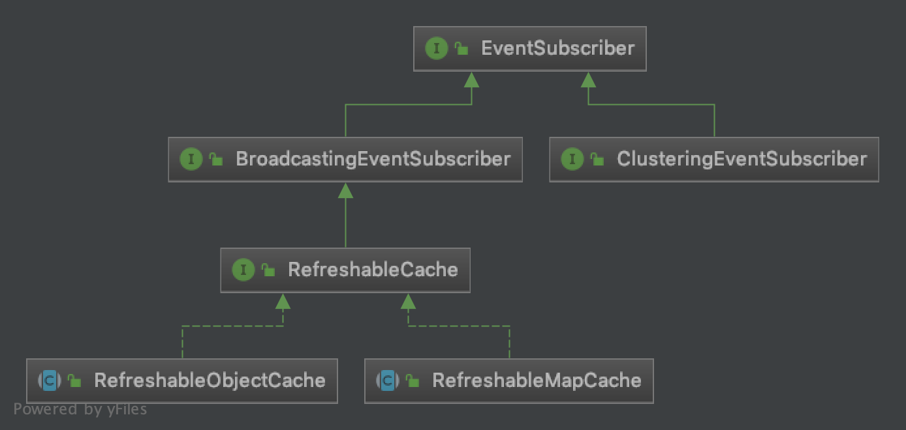

# 实时刷新的内存缓存

## 1. 实现原理
 
基于RocketMQ的广播消息来实现缓存的刷新，当原始数据发生变化时，发布一个广播消息，缓存类通过订阅该广播消息对缓存数据进行刷新。

优点：
- 数据缓存在内存中，性能极高
- 刷新及时，避免取到脏数据

缺点：
- 占用内存，不适用于大规模数据的缓存，使用时需评估内存占用情况
 
## 2. 缓存相关的接口



- 2.1 所有缓存必须实现的接口: RefreshableCache

RefreshableCache继承至BroadcastingEventSubscriber, 当接收到原始数据更改的消息时，调用refresh方法进行刷新。

```java
/**
 * 可动态刷新的缓存接口
 */
public interface RefreshableCache extends BroadcastingEventSubscriber {
  
  /**
   * 刷新缓存
   */
  void refresh(DomainEvent event);

  @Override
  default Class<? extends DomainEvent> getEventClass() {
    return DefaultEvent.class;
  }

  /**
  * 接收到数据更改通知时，刷新缓存 
  */
  @Override
  default void handleEvent(DomainEvent event) {
    refresh(event);
  }
}
```

- 2.2 基于Map数据结构的缓存：RefreshableMapCache

最常用的缓存结构，基于Map数据结构，特别适用于基础数据的缓存。

```java
/**
 * 可动态刷新的内存缓存，缓存采用HashMap数据结构
 */
public abstract class RefreshableMapCache <T> implements RefreshableCache {

  // 内存中的缓存数据，Map类型
  private Map<String, T> cacheItemsMap = null;
  private final Object lock = new Object();

  /**
   * 获取缓存数据的key值
   */
  protected abstract String getCacheKey(T data);

  /**
   * 获取实际数据的方法，缓存类调用此方法加载缓存数据
   */
  protected abstract List<T> getDataItemsActually();

  /**
   * 刷新缓存
   */
  @Override
  public void refresh(DomainEvent event) {
    synchronized (lock) {
      cacheItemsMap = null;
      log.debug("cache refreshed, cache class: {}", this.getClass().getSimpleName());
    }
  }

  /**
   * 根据key值获取缓存的数据项
   */
  public final T getDataItem(String key) {
    synchronized (lock) {
      assertDataItemsLoaded();

      var result = cacheItemsMap.get(key);
      log.debug("Exit getItem, item: {}", result);
      return result;
    }
  }

  private void assertDataItemsLoaded() {
    if (cacheItemsMap == null) {
      log.debug("starting load cache data");

      List<T> dataItems = getDataItemsActually();
      cacheItemsMap = dataItems.stream()
          .collect(Collectors.toMap(this::getCacheKey, Function.identity(), (v1, v2) -> v1));

      log.debug("cache data loaded, size: {}", dataItems.size());
    }
  }
}
```

- 2.3 直接将数据对象缓存在内存中：RefreshableObjectCache

对于一些复杂的缓存数据，可以自定义缓存的数据结构，然后将整个对象进行缓存，并提供一些特定的方法供外部访问。

```java
/**
 * 可动态刷新的内存缓存，直接将指定的数据对象缓存在内存中
 */
public abstract class RefreshableObjectCache <T> implements RefreshableCache {
  
  // 内存中的缓存数据
  private T data = null;
  private final Object lock = new Object();

  /**
   * 执行实际的加载数据接口，以加载到缓存
   */
  protected abstract T getDataActually();

  /**
   * 刷新缓存
   */
  @Override
  public void refresh(DomainEvent event) {
    synchronized (lock) {
      data = null;
      log.debug("cache refreshed, cache class: {}", getClass().getSimpleName());
    }
  }
  
  /**
   * 获取缓存的数据，初次调用时将引发加载数据的操作
   */
  protected final T getCachedData() {
    synchronized (lock) {
      assertDataLoaded();
      return data;
    }
  }

  private void assertDataLoaded() {
    if (data == null) {
      log.debug("starting load cache data");
      data = getDataActually();
      log.debug("cache data loaded");
    }
  }
}
```

